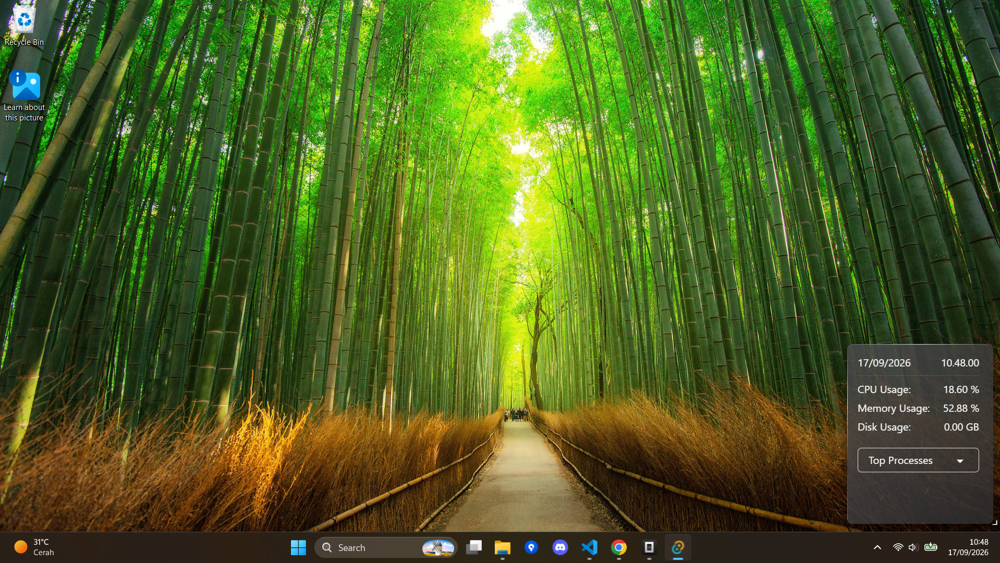
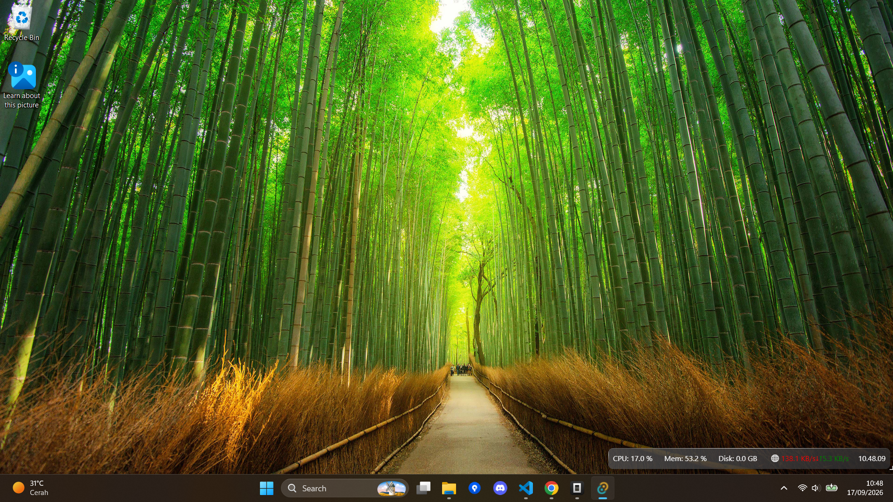
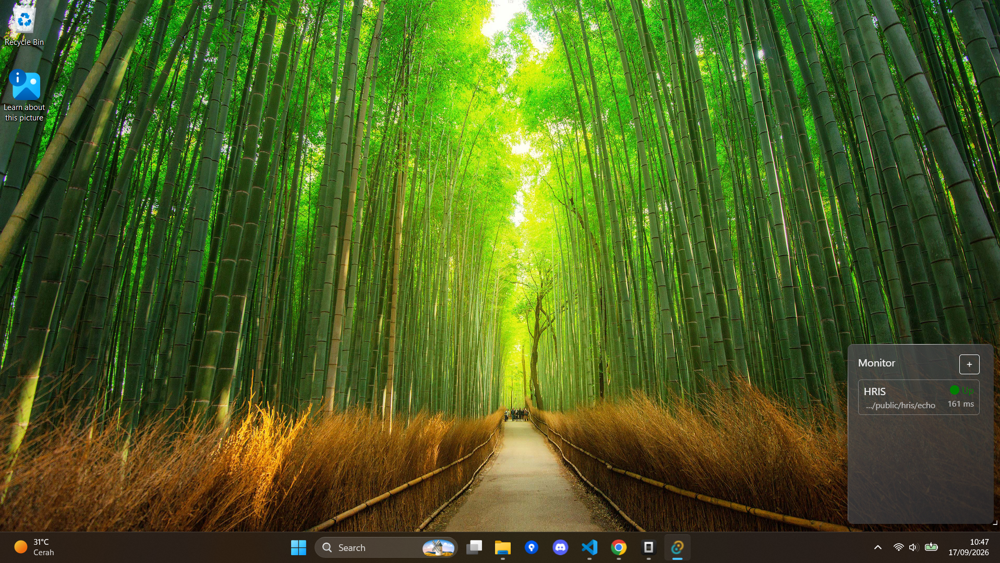
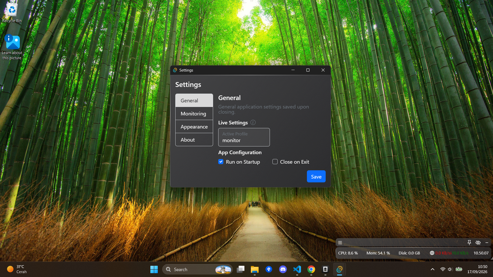

# AetherView

Rainmeter inspired app / widget, built for developers in mind, for monitoring resources, service / application status, and developer observability.

## ScreenShots

|                                  |                               |
| :------------------------------: | :---------------------------: |
|     |  |
|  |  |

## Features

- Device Monitoring
- Service / API Monitoring

### Window

- Borderless, Transparent
- Always on Top / Pin option
- Tray / Hidden
- Persistent settings, target, and profile
- Settings
- Change Opacity (soon)

### Widgets

- Clock
- General Metrics
  - CPU
  - RAM
  - Disk (not yet)
- Top Process (5)
- Developer Monitoring Widget
  - HTTP GET health
  - More soon

# Profiles

- Default
- Minimal
- Health Monitor
- Custom (not yet)
- More soon

## Version History

- 0.3.1
  - Setting Window
  - Monitoring graph
  - Persistent settings
- 0.2
  - Base Profiles (Generic, Minimal, Monitor)
  - API Health Monitor (Widget + Profile)
- 0.1
  - Initial Base Version
